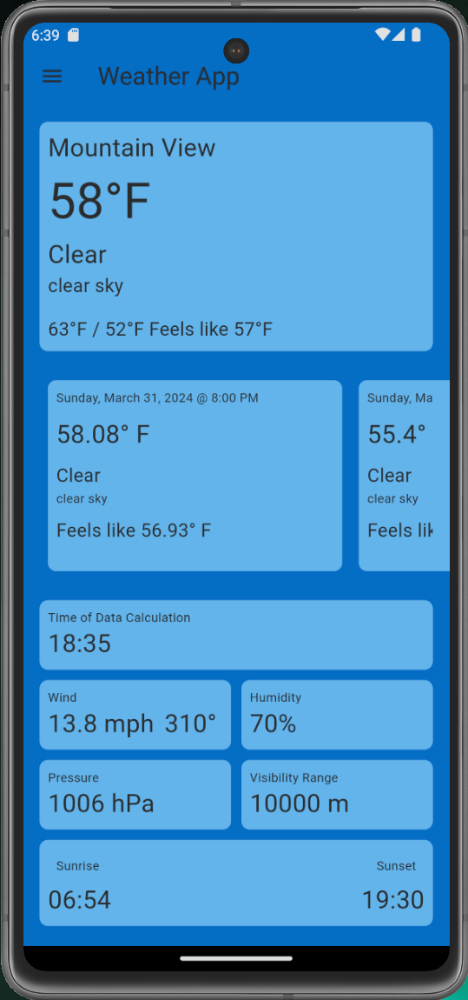
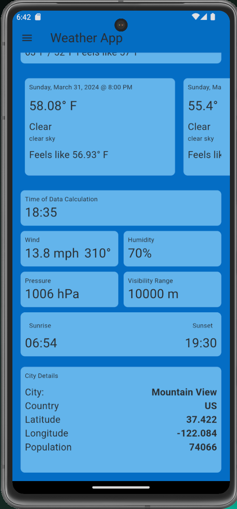
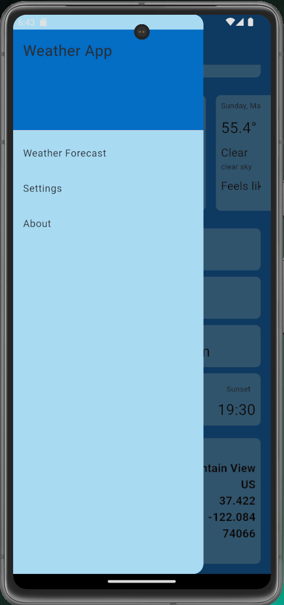

# Weather Mobile App

This is a mobile application developed using Flutter. The Weather Mobile App provides real-time weather updates and forecasts. It fetches data from a weather API and presents it in a user-friendly interface. 

Features include:
- Current temperature, humidity, and wind speed
- Weather conditions and icon representation
- Hourly forecast
- 7-day forecast

This app is a great tool for anyone who needs to keep track of weather conditions, whether for travel, event planning, or just personal interest.

## App Demo

The following are some screenshots of the app.

*Screenshot 1: Home Screen*



*Screenshot 2: Home Screen continued*



*Screenshot 3: App Drawer*



## Getting Started

To get started with this project, clone the repository and follow the installation instructions below.

## Data Source

This application uses the [OpenWeather API](https://openweathermap.org/api) to fetch weather data. OpenWeather provides a wide range of weather data including current weather, hourly forecast for 4 days, and daily forecast for 7 days.

To use this application for local devlopment, you'll need to obtain an API key from OpenWeather. You can register for a free API key on the [OpenWeather website](https://home.openweathermap.org/users/sign_up).

Once you have your API key, create an `.env` file at the root of this project. Add the following environment variable:

```env
OPEN_WEATHER_API_KEY = 'your_api_key'
```


Please note that the free tier of OpenWeather API has some limitations on the number of requests per minute. For more details, check their [pricing page](https://openweathermap.org/price).

Remember to respect the terms of use of the OpenWeather API when using this application.
